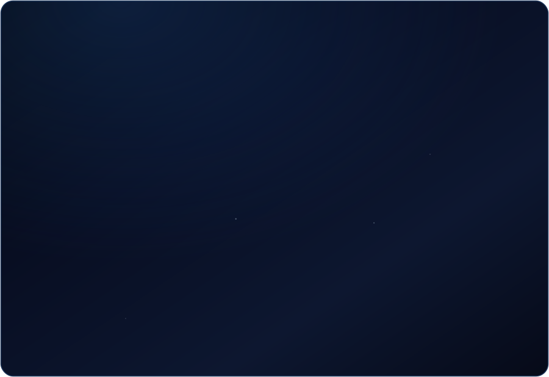

this is my little corner of github. building AI-powered systems, full-stack 
apps, and exploring anything at the intersection of software and hardware.

  
  
  

 

## // about me

 

## // certifications

## // tech stack

## // github stats

 

